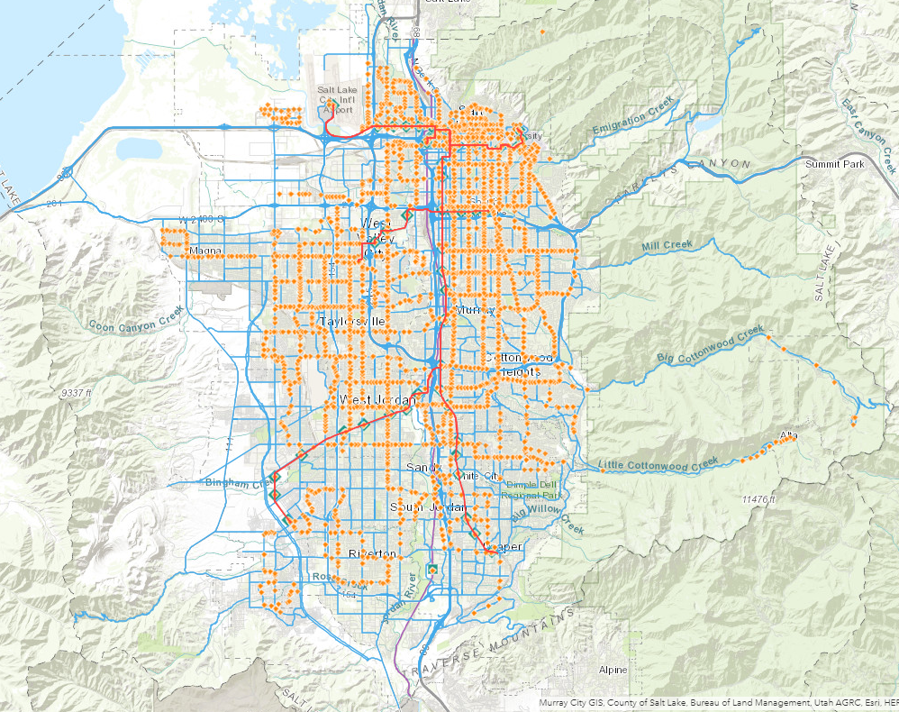

## Portfolio

---

### Academic Work

[Public Transit Analysis In Salt Lake County](/pdf/SFielding_GIS5253-999_Final_Project.pdf)

---
[Earthquakes in the State of Utah](/pdf/GIS_Final_Project_Paper.pdf)

---
VIIRS Nightlight imaging of Iraq and Syria

---
<!--
### Personal Work

- [Project 1 Title](http://example.com/)
- [Project 2 Title](http://example.com/)
- [Project 3 Title](http://example.com/)
- [Project 4 Title](http://example.com/)
- [Project 5 Title](http://example.com/)

---
-->

